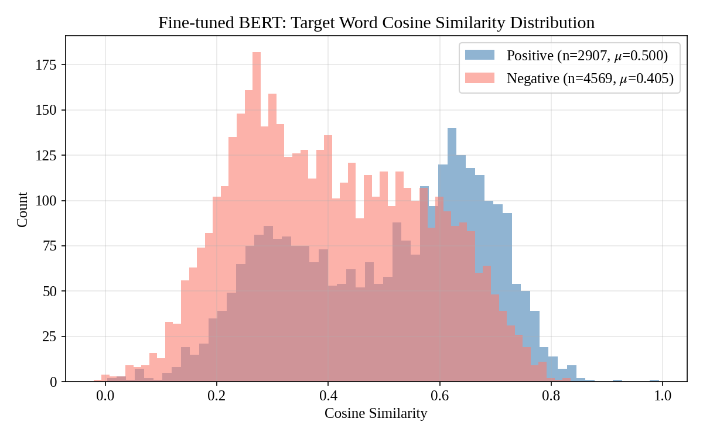
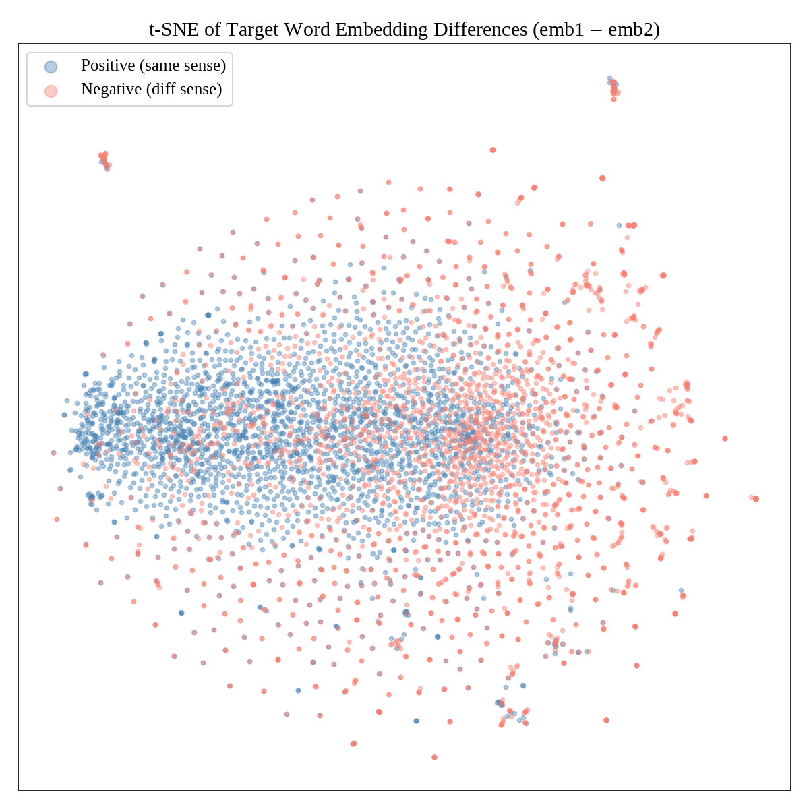
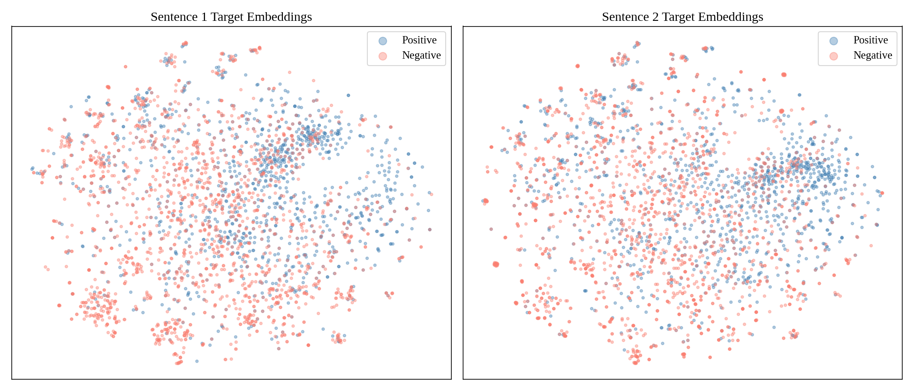
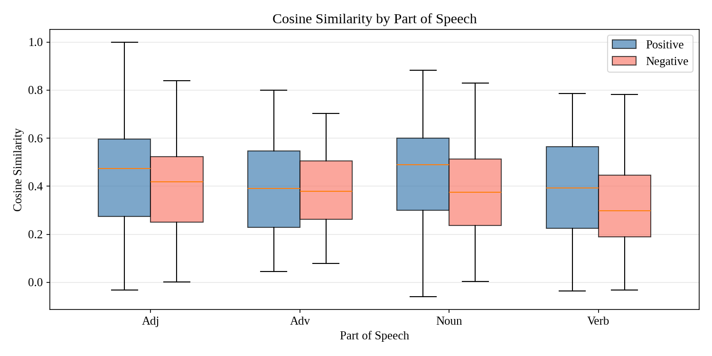
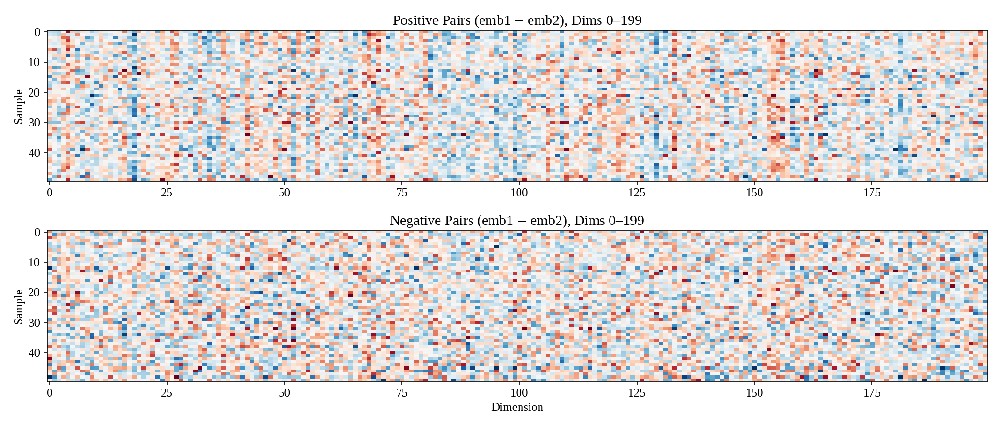
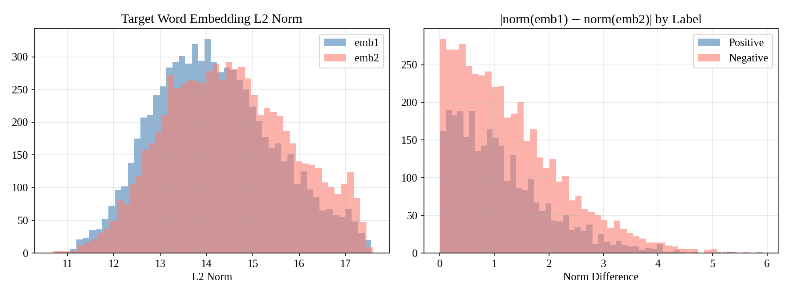

# 语言学维度分析与 BERT 上下文向量分析

## 1. 语言学维度分析

评估脚本（`src/evaluate.py`）按三个语言学维度拆分测试集，分析各模型的 Macro-F1 表现。

### 1.1 按词性（POS）

| 词性 | 样本数 | Random | BiLSTM | BERT-Frozen | BERT | RoBERTa | SBERT |
|------|--------|--------|--------|-------------|------|---------|-------|
| Adj | 993 | 0.499 | 0.463 | 0.663 | **0.676** | 0.667 | 0.562 |
| Adv | 237 | 0.472 | 0.532 | 0.555 | 0.530 | **0.559** | 0.494 |
| Noun | 2,734 | 0.500 | 0.609 | 0.737 | **0.753** | 0.728 | 0.604 |
| Verb | 3,512 | 0.468 | 0.605 | 0.665 | **0.705** | 0.697 | 0.514 |

- **Random 列为随机猜测基线**（按各子集的正负样本比例计算期望 Macro-F1）。各词性子集的类别分布差异较大（如副词正例占 73%，动词仅 25.5%），导致随机基线在不同词性间有所不同。所有模型在所有词性上均超过随机基线。
- **BERT Fine-tune 在名词和动词上表现最优**（0.753 和 0.705），RoBERTa 紧随其后。
- **名词（Noun）** 在 BERT 和 BERT-Frozen 上效果最好，可能因为名词义项边界通常更清晰。
- **副词（Adv）** 样本最少（237），各模型表现普遍较差且波动较大。BERT 在副词上仅 0.530，甚至略低于 BiLSTM（0.532），说明副词义项的区分是所有模型的共同难点。
- **形容词（Adj）** BERT（0.676）和 RoBERTa（0.667）差距很小，Sentence-BERT 在形容词上表现相对不错（0.562）。

### 1.2 按多义程度（Polysemy）

| 义项数 | 样本数 | Random | BiLSTM | BERT-Frozen | BERT | RoBERTa | SBERT |
|--------|--------|--------|--------|-------------|------|---------|-------|
| ≤3 | 2,587 | 0.478 | 0.478 | 0.606 | **0.657** | 0.638 | 0.545 |
| 4-6 | 1,648 | 0.489 | 0.448 | 0.627 | 0.626 | 0.597 | 0.532 |
| ≥7 | 3,241 | 0.433 | 0.539 | 0.661 | **0.674** | 0.666 | 0.497 |

- 随机基线在各多义组间差异较大（≤3: 0.478，≥7: 0.433），反映出高多义组正例极少（15.7%）导致类别不平衡更严重。注意 BiLSTM 在 ≤3 组的 F1（0.478）恰好等于随机基线，说明静态词向量在低多义词上几乎无效。
- **高多义词（≥7）反而更容易区分**（F1 普遍较高），而 4-6 义项组最难。这可能是因为高多义词的义项之间语义跨度更大，更容易区分；而中等多义词的义项语义距离适中，区分难度最大。
- BERT 和 RoBERTa 在各组之间的表现最为稳定，受多义程度影响较小。
- BiLSTM 在 4-6 义项组表现最差（0.448），静态词向量无法区分中等粒度的语义差异。

### 1.3 按词频（Frequency）

| 词频 | 样本数 | Random | BiLSTM | BERT-Frozen | BERT | RoBERTa | SBERT |
|------|--------|--------|--------|-------------|------|---------|-------|
| 低频 | 1,135 | 0.395 | 0.495 | 0.537 | **0.597** | 0.570 | 0.453 |
| 中频 | 416 | 0.497 | 0.392 | 0.549 | **0.612** | 0.598 | 0.579 |
| 高频 | 5,925 | 0.473 | 0.571 | 0.678 | **0.689** | 0.677 | 0.531 |

- 低频词的随机基线最低（0.395），因为正例比例高达 91.6%，类别极度不平衡。尽管如此，各模型在低频词上的绝对 F1 提升幅度仍然可观（如 BERT 0.597 vs Random 0.395，提升 20.2 个点）。
- **低频词对所有模型都是最大挑战**。BERT 在低频词上的 F1（0.597）领先 RoBERTa（0.570），说明 BERT 的微调在低频词上泛化能力更强。
- **BiLSTM 在中频词上表现最差（0.392）**，可能因为中频词的训练样本不足以让静态词向量学到有效的上下文模式。
- 高频词到低频词，所有模型的 F1 都呈下降趋势，符合"数据越多表示越好"的直觉。
- Sentence-BERT 在中频词上表现意外地不错（0.579），接近 BERT-Frozen（0.549），但在低频和高频词上表现较差。

---

## 2. BERT 上下文向量分析

分析脚本 `src/analyze_bert_embeddings.py` 从微调 BERT 中提取目标词的上下文向量，通过统计检验和可视化揭示模型的内部表示。

### 2.1 余弦相似度分析

微调后的 BERT 成功地将词义信息编码到了上下文向量中：

| 指标 | 正例（同义） | 负例（异义） | 统计检验 |
|------|------------|------------|---------|
| 余弦相似度均值 | 0.500 | 0.405 | Welch's t = 23.30, p ≈ 0, Cohen's d = 0.56（中等效应） |
| 欧氏距离均值 | 14.36 | 15.40 | Welch's t = -15.72, p ≈ 0, Cohen's d = 0.38 |
| 范数差均值 | 1.12 | 1.27 | Welch's t = -6.95, p = 3.9×10⁻¹², Cohen's d = 0.16 |

所有差异均通过 Welch's t 检验和 Mann-Whitney U 检验，95% Bootstrap 置信区间不包含 0。

### 2.2 按词性分析

| 词性 | 正例 μ | 负例 μ | Cohen's d | p 值 |
|------|--------|--------|-----------|------|
| 动词 | 0.467 | 0.382 | 0.491（中等） | 1.3×10⁻³⁰ |
| 名词 | 0.525 | 0.428 | 0.593（中等） | ≈ 0 |
| 形容词 | 0.508 | 0.459 | 0.302（小） | 2.2×10⁻⁶ |
| 副词 | 0.467 | 0.462 | 0.031（极小） | 0.832 |

名词的义项区分度最高（Cohen's d = 0.593，中等效应），动词次之。形容词效应量较小。**副词的 p = 0.832，完全不显著**，说明当前模型的向量空间几乎无法通过余弦相似度区分副词的不同义项。

### 2.3 余弦相似度 vs 完整分类头

| 方法 | Macro-F1 |
|------|----------|
| 随机猜测 | 0.494 |
| 仅用余弦阈值分类 | 0.625 |
| 完整分类头（[CLS, t1, t2] → Linear） | **0.744** |

余弦相似度只衡量方向一致性，是一个标量；分类头操作 2304 维拼接向量，可以对每个维度分别加权，捕捉更丰富的判别模式。维度激活热力图（`plots/activation_heatmap.png`）证实了差异信号分布在多个维度上。

### 2.4 Fine-tune vs Frozen

| 方法 | Dev F1 | Test Macro-F1 |
|------|--------|---------------|
| BERT Fine-tune | 0.7287 | **0.7436** |
| BERT Frozen + MLP | 0.7063 | **0.7259** |

微调让 BERT 的注意力权重和表示空间针对 WIC 任务优化，embedding 质量显著提升。冻结 BERT 时，embedding 是通用预训练表示，未学习到任务特定的义项区分知识。

### 2.5 可视化图表

以下六张图保存在 `plots/` 目录下。

#### 图 1：余弦相似度分布（`cosine_distribution.png`）

正例（蓝色，μ=0.500）和负例（红色，μ=0.405）的目标词 embedding 余弦相似度分布。两组均值差异通过 Welch's t 检验极显著（p ≈ 0），Cohen's d = 0.56 为中等效应。但两个分布严重重叠，仅靠余弦阈值分类只能达到 Macro-F1 = 0.625，远低于完整分类头的 0.744。这说明分类头利用了拼接向量中每个维度的信息，捕捉到了余弦相似度这个标量无法表达的细粒度模式。

#### 图 2：差向量 t-SNE 降维（`tsne_diff.png`）

对随机采样的测试样本，计算差向量（emb1 − emb2）并用 t-SNE 投影到二维平面。正例（蓝色）倾向于聚集在中心区域，差向量较小且集中；负例（红色）更多分布在外围区域，差向量更大且分散。这与余弦相似度分析一致：同义词对的向量更接近，异义词对的向量差异更大。边缘出现的紧密小簇可能对应特定词元（lemma），说明模型对某些词学到了非常明确的义项表示。

#### 图 3：两句目标词向量联合 t-SNE（`tsne_emb12.png`）

将句子 1 和句子 2 的目标词向量联合做 t-SNE 投影（在同一坐标系下降维后分开展示）。两个子图的空间结构高度一致，说明 BERT 将两句中的目标词映射到了同一个共享向量空间。两个子图都没有出现按标签清晰分开的聚类，这符合预期：单个向量编码的是词汇身份和上下文语义，标签是两个向量之间的关系属性（是否同义），不是单个向量的固有属性。可见的小簇对应同一词元的样本组。

#### 图 4：按词性分组的余弦相似度箱线图（`cosine_by_pos.png`）

按词性分组的正/负例余弦相似度分布。名词的正负例差值最大（Cohen's d = 0.593，中等效应），动词次之（d = 0.491）。形容词效应量较小（d = 0.302）。副词的正负例分布几乎完全重叠（d = 0.031，p = 0.832），说明模型在向量空间中对副词义项的区分能力极弱。

#### 图 5：维度激活差异热力图（`activation_heatmap.png`）

展示 768 维向量前 200 个维度的逐元素差值（emb1 − emb2），分别采样 50 个正例（上图）和 50 个负例（下图）。正例的热力图整体偏白（差异小），表明同义词对在大多数维度上的激活值相似。负例出现更多深色区域（深蓝和深红），表明异义词对在许多维度上存在显著激活差异。关键观察是差异信号分布在多个维度上，而非集中在少数几个维度，这解释了为什么线性分类头（可以对每个维度分别加权）能显著超越单一余弦相似度。

#### 图 6：L2 范数分布（`norm_distribution.png`）

左图展示 emb1 和 emb2 的 L2 范数分布，两者几乎完全重合，说明 BERT 不会因句子位置不同而系统性地产生不同长度的向量。右图展示范数绝对差值的分布：正例（蓝色）集中在 0 附近，负例（红色）有更长的尾部。范数差异提供了余弦相似度之外的补充判别信号（Welch's t = -6.95, p = 3.9×10⁻¹²），但效应量很小（Cohen's d = 0.16），说明在微调 BERT 的向量空间中，方向差异（余弦相似度，d = 0.56）是义项区分的主要信号，长度差异仅是微弱的辅助信号。
