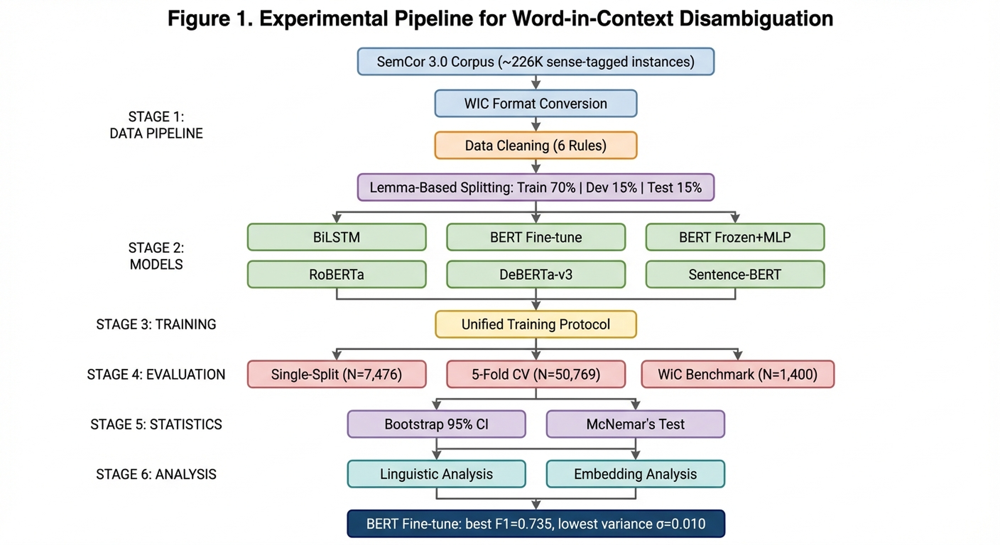

# 3. Methodology

The present section describes the experimental methodology adopted in this study. The overall research pipeline — from corpus construction through model comparison to statistical validation — is depicted in Figure 1. Each subsection below corresponds to a major stage in this pipeline.

## 3.1 Task Formulation

The present study investigates the Word-in-Context (WIC) disambiguation task, a binary classification problem first formalized by Pilehvar and Camacho-Collados (2019). Given a polysemous target word *w* occurring in two distinct sentential contexts *s*₁ and *s*₂, the task requires determining whether *w* conveys the same meaning across both occurrences. Formally, each instance is represented as a quintuple (*w*, *s*₁, *s*₂, *i*₁, *i*₂), where *i*₁ and *i*₂ denote the positional indices of *w* in *s*₁ and *s*₂, respectively, and the model outputs a binary label *y* ∈ {0, 1}. A prediction of *y* = 1 indicates that the two occurrences share the same sense, whereas *y* = 0 indicates that they express distinct meanings.

Unlike traditional word sense disambiguation (WSD), which assigns a predefined sense tag from a lexical inventory (Navigli, 2009), the WIC formulation abstracts away from any particular sense inventory and instead frames disambiguation as a pairwise judgment. This design choice renders the evaluation model-agnostic and eliminates the dependency on inventory granularity — a long-standing confound in WSD evaluation (Raganato et al., 2017).

Macro-averaged F1 (Macro-F1) was adopted as the primary evaluation metric. Because the dataset exhibits a notable class imbalance (positive ratio ≈ 37.4%), accuracy would disproportionately reward majority-class predictions, potentially masking meaningful performance differences across models (Opitz & Burst, 2019). Macro-F1 addresses this concern by weighting both classes equally, thereby providing a more balanced assessment of discriminative performance.

## 3.2 Dataset Construction

### 3.2.1 Source Corpus

The experimental dataset was derived from SemCor 3.0 (Miller et al., 1993), a subset of the Brown Corpus in which content words have been manually annotated with WordNet synset identifiers. Comprising approximately 226,000 sense-tagged word instances across multiple parts of speech, SemCor remains the largest manually sense-annotated corpus available in English and has long served as a benchmark resource in computational lexical semantics (Navigli, 2009). Its fine-grained WordNet annotations provide the sense distinctions necessary for constructing positive and negative WIC pairs.

### 3.2.2 WIC Format Conversion

The raw SemCor annotations were transformed into WIC-format instances through a systematic pairing procedure. First, for each sense-annotated token in the corpus, a tuple comprising the lemma, part of speech, synset identifier, host sentence, and word position index was extracted. These tuples were then grouped by lemma and further partitioned by synset within each lemma group. Positive instances (label *y* = 1) were generated by randomly sampling pairs of occurrences that share the same synset but appear in different sentences, thereby ensuring that the two contexts are distinct despite conveying the same sense. Negative instances (label *y* = 0) were generated by pairing occurrences of the same lemma drawn from different synsets, capturing genuine sense distinctions. This construction guarantees that both positive and negative instances involve the same surface word form, compelling models to rely on contextual information rather than lexical cues.

### 3.2.3 Data Cleaning

To ensure the quality and fairness of the resulting dataset, six filtering rules were applied sequentially. First, negative instances in which the target word appeared with different parts of speech across the two sentences were removed, as such pairs can be trivially resolved by part-of-speech information alone without engaging semantic reasoning (Rule 1). Second, positive instances in which the two sentences were identical were discarded, as they require no disambiguation whatsoever (Rule 2). Third, instances with misaligned target word indices — where the recorded position did not correspond to the expected surface form — were excluded as data alignment errors (Rule 3). Fourth, duplicate instances sharing the same sentence pair and lemma were deduplicated to prevent evaluation bias (Rule 4). Fifth, instances in which either sentence contained fewer than five tokens were removed on the grounds that minimal context is insufficient for meaningful disambiguation (Rule 5). Finally, instances exceeding 256 subword tokens (as determined by the BERT tokenizer; Devlin et al., 2019) were excluded to maintain consistency with the maximum sequence length adopted across all transformer-based models and to prevent target word truncation during encoding (Rule 6).

### 3.2.4 Data Splitting

The cleaned dataset was partitioned into training (70%), development (15%), and test (15%) sets using a lemma-based splitting strategy, in which all instances sharing the same lemma were assigned to exactly one partition. This constraint is critical for evaluation validity: without it, models could memorize lemma-specific sense patterns from training instances and exploit them during testing, leading to inflated performance estimates that do not reflect genuine generalization (Raganato et al., 2017). The resulting dataset comprised 50,769 instances, as summarized in Table 1.

**Table 1**

*Dataset Statistics After Cleaning and Splitting*

| Split | *N* | Positive | Negative | Positive ratio (%) |
|-------|----:|--------:|---------:|-------------------:|
| Training | 35,547 | 13,083 | 22,464 | 36.8 |
| Development | 7,746 | 3,013 | 4,733 | 38.9 |
| Test | 7,476 | 2,907 | 4,569 | 38.9 |
| Total | 50,769 | 19,003 | 31,766 | 37.4 |

## 3.3 Model Architectures

To systematically examine how different representational paradigms affect WIC disambiguation performance, six models were implemented, spanning four distinct approaches to meaning representation: static word embeddings (BiLSTM), frozen contextualized features (BERT-Frozen), fine-tuned contextualized models (BERT, RoBERTa, DeBERTa-v3), and sentence-level embeddings (Sentence-BERT). Two non-parametric baselines — a random baseline that samples predictions according to the training set class distribution and a majority baseline that uniformly predicts the dominant class — were additionally included to establish lower performance bounds. The complete experimental pipeline is illustrated in Figure 1.

**Figure 1**

*Experimental Pipeline for Word-in-Context Disambiguation*

*Note.* The pipeline proceeds through six stages: corpus construction and cleaning (top), lemma-based data splitting, model training across six architectures, unified training protocol, multi-level evaluation, and statistical validation with linguistic and embedding analysis (bottom). Arrows indicate data flow and dependencies between stages.

### 3.3.1 BiLSTM with Static Embeddings

The BiLSTM model was included as a non-contextualized baseline to assess the extent to which static word representations, augmented with sequential context modeling, can support lexical disambiguation. Each sentence was first mapped to a sequence of 100-dimensional GloVe vectors (Pennington et al., 2014), drawn from the 6-billion-token, 400,000-word pre-trained vocabulary. These embeddings were allowed to update during training to permit task-specific adjustment. The resulting token sequences were independently encoded by a single-layer bidirectional LSTM with a hidden dimension of 128 per direction, yielding a 256-dimensional hidden state at each timestep. For each sentence, the hidden state at the target word position was extracted as the word-level representation. The two 256-dimensional target word vectors were then concatenated to form a 512-dimensional feature vector, which was passed through a two-layer feed-forward classifier (hidden dimension 64, ReLU activation, dropout rate 0.3) to produce a binary prediction.

This architecture deliberately separates the representational contribution of static embeddings from the sequential context modeled by the LSTM, providing a principled point of comparison against contextualized models in which word representations are inherently context-dependent.

### 3.3.2 BERT Fine-Tuning

The BERT-based model followed the fine-tuning paradigm introduced by Devlin et al. (2019), using the base uncased variant (12 transformer layers, 768 hidden dimensions, approximately 110 million parameters). The two input sentences were concatenated into a single sequence of the form [CLS] *s*₁ [SEP] *s*₂ [SEP] and jointly encoded, allowing bidirectional self-attention to capture cross-sentence dependencies. The target word in each sentence segment was localized at the subword level by exploiting the tokenizer's word-to-token alignment mappings, and the hidden state corresponding to the first subword token of each target word occurrence was extracted from the final transformer layer.

The classification head operated on a concatenation of three 768-dimensional vectors: the [CLS] pooled representation, the target word vector from *s*₁, and the target word vector from *s*₂. This 2,304-dimensional composite was passed through a dropout layer (rate 0.1) followed by a single linear projection to two output logits. All model parameters — including the pre-trained transformer weights — were updated during training, enabling the representation space to adapt to the demands of the WIC task.

### 3.3.3 BERT Frozen with MLP Classifier

To disentangle the contribution of task-specific fine-tuning from the quality of general-purpose pre-trained representations, an ablation variant was implemented in which all BERT parameters were frozen during training. The same three-vector extraction strategy described above (Section 3.3.2) was applied, but the resulting 2,304-dimensional feature was fed into a separately trained three-layer multilayer perceptron (MLP) with hidden dimensions of 512 and 256, ReLU activations, and dropout rates of 0.3 and 0.2 at successive layers. This configuration reduced the trainable parameter count to approximately 1.31 million — roughly 1.2% of the full fine-tuning variant — while preserving the representational capacity of the pre-trained encoder. Comparing this model against the fine-tuned variant isolates the marginal benefit of allowing the encoder to restructure its representation space for the specific downstream task.

### 3.3.4 RoBERTa Fine-Tuning

RoBERTa (Liu et al., 2019) represents a robustly optimized variant of BERT that modifies several pre-training decisions: it employs a substantially larger training corpus (160 GB compared to BERT's 16 GB), uses dynamic masking rather than static masking, removes the next-sentence prediction objective, and adopts byte-pair encoding tokenization. The base variant (12 layers, 768 hidden dimensions, approximately 125 million parameters) was fine-tuned using the same three-vector classification strategy as BERT, with input formatted as \<s\> *s*₁ \</s\>\</s\> *s*₂ \</s\> in accordance with the RoBERTa tokenization convention. The learning rate was set to 2 × 10⁻⁵, slightly lower than the 3 × 10⁻⁵ used for BERT, following recommendations in the original work. Including RoBERTa in the comparison allows us to assess whether improved pre-training alone — without architectural changes — translates to better disambiguation performance.

### 3.3.5 DeBERTa-v3 Fine-Tuning

DeBERTa-v3 (He et al., 2021, 2023) introduces a disentangled attention mechanism that encodes content and positional information through two separate vector streams, enabling the model to attend to content-content, content-position, and position-content interactions independently. This architectural innovation is theoretically well-suited to the WIC task, where the precise position of the target word within the sentence is critical for extracting context-sensitive representations. The base variant (12 layers, 768 hidden dimensions, approximately 184 million parameters) was fine-tuned with several task-specific modifications.

First, target word representations were obtained by averaging the hidden states of all subword tokens belonging to the target word via masked mean pooling, rather than selecting only the first subword token as in BERT and RoBERTa. This strategy better captures the semantics of morphologically complex words that are split into multiple subword units. Second, a richer feature concatenation scheme was adopted: the classifier received a five-way concatenation of the [CLS] representation, the two target word vectors (*t*₁ and *t*₂), their element-wise difference (*t*₁ − *t*₂), and their Hadamard product (*t*₁ ⊙ *t*₂), yielding a 3,840-dimensional input (768 × 5). The difference vector captures directional semantic divergence between the two occurrences, while the Hadamard product encodes dimension-level feature interactions. This composite was processed by a two-layer classifier with a hidden dimension of 256 and GELU activations. Notably, BF16 mixed-precision training was employed instead of FP16, as DeBERTa-v3's layer normalization is known to produce numerical overflow under FP16 (He et al., 2023). Additionally, class weights were smoothed using the square root of the inverse class frequency (√(*n*_neg / *n*_pos) ≈ 1.31) rather than linear inverse weighting, to mitigate the risk of over-correcting for class imbalance.

### 3.3.6 Sentence-BERT (Zero-Shot Baseline)

To evaluate whether sentence-level pre-trained representations can support fine-grained lexical disambiguation without explicit access to target word positional information, a zero-shot Sentence-BERT baseline was implemented using the all-MiniLM-L6-v2 model (Wang et al., 2020; Reimers & Gurevych, 2019), a distilled six-layer transformer producing 384-dimensional sentence embeddings. Each sentence was independently encoded, and mean pooling was applied over the final hidden layer to obtain a fixed-length sentence vector. Classification was performed by computing the cosine similarity between the two sentence embeddings and comparing it against a threshold optimized via grid search on the development set (range: 0.50 to 1.00, step size: 0.01). No model parameters were updated during this process.

This configuration serves a specific diagnostic purpose: by removing all target-word-level positional information and relying solely on holistic sentence similarity, it isolates the contribution of representational granularity to WIC performance. If sentence-level representations prove inadequate, this would constitute evidence that explicit modeling of the target word's contextual representation is essential for the task.

## 3.4 Training Protocol

A unified training protocol was adopted to ensure fair and reproducible comparison across all supervised models (see Figure 1, Training Configuration). Several hyperparameters were shared: maximum sequence length of 256 tokens, batch size of 32, and a global random seed of 42 applied to all sources of stochasticity. Gradient norms were clipped to a maximum of 1.0 for all transformer-based models. Model-specific hyperparameters, including learning rates, total training epochs, early stopping patience, and numerical precision settings, are summarized in Table 2.

**Table 2**

*Model-Specific Training Hyperparameters*

| Model | Trainable parameters | Optimizer | Learning rate | Max epochs | Patience | Precision |
|-------|--------------------:|-----------|-------------:|-----------:|---------:|-----------|
| BiLSTM | ~0.5M | Adam | 1 × 10⁻³ | 8 | 3 | FP32 |
| BERT-Frozen + MLP | 1.31M | Adam | 1 × 10⁻³ | 8 | 3 | FP32 |
| BERT Fine-tune | ~110M | AdamW | 3 × 10⁻⁵ | 8 | 3 | FP16 |
| RoBERTa Fine-tune | ~125M | AdamW | 2 × 10⁻⁵ | 8 | 3 | FP16 |
| DeBERTa-v3 Fine-tune | ~184M | AdamW | 2 × 10⁻⁵ | 10 | 5 | BF16 |
| Sentence-BERT | — | — | — | — | — | — |

*Note.* Sentence-BERT was used in a zero-shot setting with no parameter updates. Patience denotes the number of consecutive epochs without improvement in development set Macro-F1 before early stopping is triggered.

Given the class imbalance observed in the training set (36.8% positive instances), all supervised models employed a weighted cross-entropy loss function in which the class weights were set proportional to the inverse class frequency. This weighting ensures that the minority class (positive, i.e., same-sense pairs) exerts an influence on the gradient signal commensurate with that of the majority class (negative). For DeBERTa-v3, the weights were further smoothed using a square-root transformation to reduce the risk of over-correction, a design choice informed by preliminary experiments in which linear inverse weighting led to unstable training dynamics.

The three transformer-based fine-tuning models (BERT, RoBERTa, DeBERTa-v3) employed a linear warmup-and-decay learning rate schedule, following the protocol established by Devlin et al. (2019): the learning rate increased linearly from zero to its target value over the first 10% of training steps and then decayed linearly to zero over the remaining steps. These models used the AdamW optimizer (Loshchilov & Hutter, 2019) with a weight decay coefficient of 0.01. The BiLSTM and BERT-Frozen MLP models, by contrast, used the standard Adam optimizer with a fixed learning rate of 1 × 10⁻³, as preliminary experiments indicated that learning rate scheduling provided no benefit for these architectures.

All models were trained with early stopping monitored on the development set Macro-F1: training was terminated after *P* consecutive epochs without improvement, and the checkpoint with the highest development Macro-F1 was restored for final evaluation. Patience was set to *P* = 3 for all models except DeBERTa-v3 (*P* = 5), which exhibited slower convergence in preliminary runs. BERT and RoBERTa utilized FP16 mixed-precision training for computational efficiency, while DeBERTa-v3 required BF16 precision due to a known numerical incompatibility with FP16. The BiLSTM and BERT-Frozen models were trained in full FP32 precision.

To ensure reproducibility, the random seed was applied uniformly across Python's built-in random number generator, NumPy, and all PyTorch CPU and CUDA generators. Deterministic behavior was further enforced through framework-level settings. All experiments were conducted on a single-GPU environment.

## 3.5 Evaluation Framework

A multi-level evaluation strategy was adopted to provide converging evidence regarding model performance, as depicted in the lower portion of Figure 1. This strategy encompasses single-split evaluation, cross-validated estimation, statistical significance testing, and cross-domain generalization assessment.

### 3.5.1 Single-Split Evaluation

The primary evaluation was conducted on the held-out test set (*N* = 7,476), which is lemma-disjoint from both the training and development partitions. Four metrics were reported for each model: accuracy, macro-averaged precision, macro-averaged recall, and Macro-F1.

### 3.5.2 Lemma-Grouped 5-Fold Cross-Validation

To obtain more robust performance estimates and to support subsequent statistical testing, a lemma-grouped 5-fold cross-validation procedure was conducted over the entire dataset (*N* = 50,769). All unique lemmas were sorted alphabetically, shuffled with a fixed seed, and distributed round-robin into five groups (*G*₀ through *G*₄). For each fold *i*, the instances associated with lemmas in *G*ᵢ formed the test set, those in *G*₍ᵢ₊₁₎ mod ₅ formed the development set, and the remaining three groups constituted the training set. This design guarantees that the five test sets are mutually exclusive and collectively exhaustive — every instance in the dataset is evaluated exactly once — while preserving the lemma-disjoint property within each fold. Results were reported as the mean and standard deviation of Macro-F1 across the five folds.

### 3.5.3 Bootstrap Confidence Intervals

To quantify estimation uncertainty, non-parametric bootstrap confidence intervals (Efron & Tibshirani, 1993) were computed for each model. Predictions from all five folds were pooled to form a single set of *N* = 50,769 instance-level predictions. For each of 1,000 bootstrap iterations, *N* instances were sampled with replacement, and Macro-F1 was computed on the resampled set. The 2.5th and 97.5th percentiles of the resulting empirical distribution defined the 95% confidence interval. Non-overlapping confidence intervals between two models provide evidence of a statistically significant performance difference (Efron & Tibshirani, 1993).

### 3.5.4 McNemar's Pairwise Test

To evaluate the statistical significance of performance differences at the instance level, McNemar's test (McNemar, 1947) with Edwards' continuity correction (Edwards, 1948) was applied to all 15 pairwise model comparisons. For each model pair, the pooled five-fold predictions were used to construct a 2 × 2 contingency table, in which cell *b* records the number of instances that model A classified correctly but model B did not, and cell *c* records the converse. The corrected test statistic was computed as χ² = (|*b* − *c*| − 1)² / (*b* + *c*), and the corresponding *p*-value was obtained from the chi-squared distribution with one degree of freedom. Statistical significance was assessed at α = 0.05. To evaluate the robustness of these findings, McNemar's test was additionally conducted separately within each of the five folds, providing fold-level *p*-values that indicate whether observed differences are stable across data partitions or are driven by specific subsets of the data.

### 3.5.5 Cross-Domain Generalization

To assess the degree to which models trained on SemCor-derived data generalize to out-of-distribution inputs, all models were evaluated on the official WiC benchmark (Pilehvar & Camacho-Collados, 2019), which consists of 638 development and 1,400 test instances. The official benchmark differs from the present dataset in several important respects: its instances are drawn from WordNet example sentences, VerbNet, and Wiktionary rather than from running text in SemCor; it is restricted to nouns and verbs; and it maintains a perfectly balanced class distribution (50% positive, 50% negative). This evaluation provides an estimate of domain shift effects and reveals the extent to which learned representations capture transferable sense-discriminative information beyond the distributional characteristics of the training corpus.

## 3.6 Linguistic Dimension Analysis

Beyond aggregate performance metrics, the test set was stratified along three linguistically motivated dimensions to reveal systematic patterns in model behavior.

In the part-of-speech analysis, instances were grouped by the POS tag of the target word — verb, noun, adjective, or adverb — and Macro-F1 was computed within each subgroup. Because class distributions vary substantially across POS categories (e.g., 73% of adverb instances are positive, compared with only 25.5% for verbs), per-subgroup random-guess baselines were computed to enable calibrated comparison.

In the polysemy analysis, target words were categorized by the number of synsets listed in WordNet: low polysemy (≤ 3 senses), medium polysemy (4–6 senses), and high polysemy (≥ 7 senses). This stratification examines the relationship between sense inventory granularity and disambiguation difficulty, testing the intuition that more polysemous words — whose senses are more numerous but potentially more semantically distant — may present either greater or lesser challenge depending on the degree of inter-sense overlap.

In the frequency analysis, target words were categorized by their occurrence count in the training set into low-, medium-, and high-frequency groups. This dimension assesses whether models exhibit a performance gradient tied to training data sufficiency, and whether certain architectures are more robust to data sparsity than others.

## 3.7 Contextualized Embedding Analysis

To investigate the internal mechanisms by which the fine-tuned BERT model encodes word sense distinctions, a series of probing analyses were conducted on the 768-dimensional contextualized embeddings extracted from the final transformer layer.

### 3.7.1 Distributional Analysis of Cosine Similarity

For each test instance, the target word embeddings from *s*₁ and *s*₂ were extracted, and their cosine similarity was computed. The resulting distributions for positive (same-sense) and negative (different-sense) instances were compared using both parametric and non-parametric methods: Welch's *t*-test (Welch, 1947) for mean comparison without the equal-variance assumption, the Mann-Whitney *U* test for distributional comparison, and Cohen's *d* for effect size quantification. Additionally, 95% bootstrap confidence intervals (1,000 resamples) were constructed around the mean difference to confirm the robustness of observed effects.

### 3.7.2 Ablation of Representational Components

Two targeted comparisons were conducted to isolate specific contributors to classification performance. First, a cosine-threshold classifier — which predicts the label based solely on whether the cosine similarity between the two target word embeddings exceeds an optimized threshold — was compared against the full three-vector classifier that operates on the 2,304-dimensional concatenation of [CLS], *t*₁, and *t*₂. This comparison quantifies the additional discriminative information captured by multi-dimensional feature interactions beyond what a single scalar similarity measure can encode. Second, embeddings extracted from the fine-tuned BERT were compared against those from the frozen variant, revealing the extent to which task-specific fine-tuning reorganizes the representation space to amplify sense-relevant features.

### 3.7.3 Visualization

Six complementary visualization techniques were employed to make the high-dimensional embedding structure interpretable. Cosine similarity distributions were plotted as overlaid histograms with kernel density estimation to visualize the degree of overlap between positive and negative instances. Difference vectors (*t*₁ − *t*₂) were projected into two dimensions via t-SNE (van der Maaten & Hinton, 2008) to assess whether same-sense and different-sense pairs form separable clusters in the difference space. A joint t-SNE projection of *t*₁ and *t*₂ was used to verify that the model maps both sentence positions into a shared representational space. POS-stratified boxplots of cosine similarity revealed how sense-discriminative power varies across parts of speech. A dimension-level activation heatmap displayed the element-wise differences between target word pairs across the first 200 embedding dimensions, revealing whether the discriminative signal is concentrated in a few dimensions or distributed broadly. Finally, L2 norm distributions were plotted to disentangle directional similarity (captured by cosine) from magnitude-based signals, clarifying the relative contribution of each to sense discrimination.

---

## References

Devlin, J., Chang, M.-W., Lee, K., & Toutanova, K. (2019). BERT: Pre-training of deep bidirectional transformers for language understanding. In *Proceedings of the 2019 Conference of the North American Chapter of the Association for Computational Linguistics: Human Language Technologies* (pp. 4171–4186). Association for Computational Linguistics.

Edwards, A. L. (1948). Note on the "correction for continuity" in testing the significance of the difference between correlated proportions. *Psychometrika*, *13*(3), 185–187.

Efron, B., & Tibshirani, R. J. (1993). *An introduction to the bootstrap*. Chapman & Hall/CRC.

He, P., Liu, X., Gao, J., & Chen, W. (2021). DeBERTa: Decoding-enhanced BERT with disentangled attention. In *Proceedings of the 9th International Conference on Learning Representations*.

He, P., Gao, J., & Chen, W. (2023). DeBERTaV3: Improving DeBERTa using ELECTRA-style pre-training with gradient-disentangled embedding sharing. In *Proceedings of the 11th International Conference on Learning Representations*.

Liu, Y., Ott, M., Goyal, N., Du, J., Joshi, M., Chen, D., Levy, O., Lewis, M., Zettlemoyer, L., & Stoyanov, V. (2019). RoBERTa: A robustly optimized BERT pretraining approach. *arXiv preprint arXiv:1907.11692*.

Loshchilov, I., & Hutter, F. (2019). Decoupled weight decay regularization. In *Proceedings of the 7th International Conference on Learning Representations*.

McNemar, Q. (1947). Note on the sampling error of the difference between correlated proportions or percentages. *Psychometrika*, *12*(2), 153–157.

Miller, G. A., Leacock, C., Tengi, R., & Bunker, R. T. (1993). A semantic concordance. In *Proceedings of the Workshop on Human Language Technology* (pp. 303–308). Association for Computational Linguistics.

Navigli, R. (2009). Word sense disambiguation: A survey. *ACM Computing Surveys*, *41*(2), 1–69.

Opitz, J., & Burst, S. (2019). Macro F1 and macro F1. *arXiv preprint arXiv:1911.03347*.

Pennington, J., Socher, R., & Manning, C. D. (2014). GloVe: Global vectors for word representation. In *Proceedings of the 2014 Conference on Empirical Methods in Natural Language Processing* (pp. 1532–1543). Association for Computational Linguistics.

Pilehvar, M. T., & Camacho-Collados, J. (2019). WiC: The Word-in-Context dataset for evaluating context-sensitive meaning representations. In *Proceedings of the 2019 Conference of the North American Chapter of the Association for Computational Linguistics: Human Language Technologies* (pp. 1267–1273). Association for Computational Linguistics.

Raganato, A., Camacho-Collados, J., & Navigli, R. (2017). Word sense disambiguation: A unified evaluation framework and empirical comparison. In *Proceedings of the 15th Conference of the European Chapter of the Association for Computational Linguistics* (pp. 99–110). Association for Computational Linguistics.

Reimers, N., & Gurevych, I. (2019). Sentence-BERT: Sentence embeddings using Siamese BERT-networks. In *Proceedings of the 2019 Conference on Empirical Methods in Natural Language Processing and the 9th International Joint Conference on Natural Language Processing* (pp. 3982–3992). Association for Computational Linguistics.

van der Maaten, L., & Hinton, G. (2008). Visualizing data using t-SNE. *Journal of Machine Learning Research*, *9*(86), 2579–2605.

Wang, W., Wei, F., Dong, L., Bao, H., Yang, N., & Zhou, M. (2020). MiniLM: Deep self-attention distillation for task-agnostic compression of pre-trained transformers. In *Advances in Neural Information Processing Systems 33* (pp. 5776–5788).

Welch, B. L. (1947). The generalization of "Student's" problem when several different population variances are involved. *Biometrika*, *34*(1–2), 28–35.
